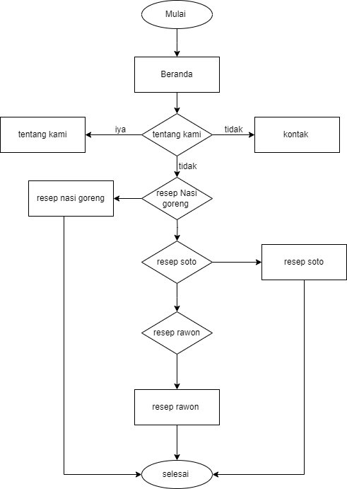
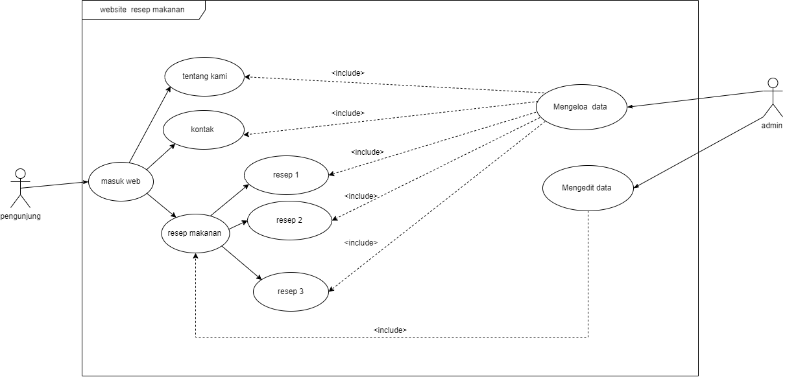
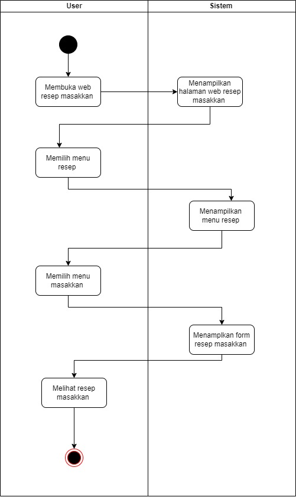

Software Requirements Specification
(Website Resep Makanan: Selera Kita)

PENDAHULUAN 
- TUJUAN
Dokumen ini merupakan Spesifikasi untuk membangun website yang efisien. Tujuan penulisan dokumen ini dengan judul “Website Resep Makanan : Selera Kita” adalah untuk mengidentifikasi dan memberikan informasi dasar yang harus dipenuhi oleh perangkat lunak yang akan dikembangkan. Dokumen ini juga memastikan bahwa pengembang website faham dan jelas tentang apa yang diharapkan dari perangkat lunak  yang dikembangkan. SKPL menjadi panduan yang berguna untuk pengembang dalam mengembangakan website dengan efesien.

- AUDIENS YANG DITUJU DAN PEMBACA YANG DISARANKAN 
Audiens : Audiens yang dituju yaitu para pecinta masakan kuliner, pecinta makanan sehat, dan ibu rumah tangga yang tertark untuk mendapatkan berbagai informasi dan resep masakkan yang mudah dan dapat dibua sendiri
saran : Dokumentasi SRS Website Resep Makanan ini digunakan unuk memberikan informasi kepada audiens tentang resep - resep makanan. Oleh karena itu, kami menyarankan para audiens membaca dokumen SRS ini dengan cermat 

- RUANG LINGKUP 
Perangkat lunak yang akan dikembangakan adalah Website Resep makanan yaitu Selera Kita yang dapat digunakan atau diakses oleh semua orang.

DESKRIPSI KEBUTUHAN FUNGSIONAL 
- PERSPEKTIF PRODUK
Website resep makanan "Selera Kita" yaitu sebuah website yang menampilkan berbagai resep makanan. Website ini dirancang dengan tujuan untuk menginspirasi dan membantu pengguna dalam mempersiapkan hidangan yang lezat dan memuaskan. Website ini memiliki tata letak dan desain yang muda untuk dinavigasi oleh user
Setiap resep dalam website ini disertai dengan deskripsi yang rinci, termasuk bahan - bahan yang diperlukan dan langkah - langkah memasak yang mudah untuk dipahami. Setiap resep dilengkapi dengan gambar - gambar berkualitas dari hidangan yang sudah jadi. Gambar - gambar ini memungkikan user untuk memvisualisasikan hasil akhir dan memberikan motivasi untuk mencoba.

- FUNGSI PRODUK
Website Resep Makanan "Selera Kita" memiliki beragam fungsi. berikut merupakan beberapa fungsi dari website Resep Makanan Selera Kita :
  - Website Resep Makanan " Selera Kita" dapat memberikan informasi yang inspirasi untuk memasak dan juga 
    dapat mencoba hidangan baru.
  - Website Resep Makanan " Selera Kita" ini memberikan panduan memasak langkah demi langkah dalam 
    menghidangkan masakkan yang dipilih yang dapat membantu pengguna yang kurang berpengalaman dalam 
    memasak
  - Website Resep Makanan " Selera Kita" juga dapat menjadi sarana pembelajaran dan juga mengembangakan 
    keterampilan memasak.

- KARAKTERISTIK PENGGUNA
Karakteristik pengguna yang menggunakan perangkat lunak Task SUbmission yaitu:
  - Pengguna
    a. Memiliki perangkat elektronik (handphone/cp)
    b. Memiliki akses internet
    c. Memahami cara kerja perangkat elektronik yang digunakan

- LINGKUNGAN OPERASI
Software Website resep makanan dapat dijalankan pada:
  - Windows
    - Windows 7,8,8.1,10
    - Web browser (Google Chrome, Firefox, Microsoft Edge)
      
  - Android
    - Android 4.0 atau lebih baik
    - RAM : 512 MB
      
- KENDALA DESAIN DAN IMPLEMENTASI
Kendala yang dialami dalam proses pembuatan desain dan implementasi website Resep Makanan “Selera Kita” yaitu:
  - Mengalami kesulitan dalam menemukan ide dan desain website yang pas.
  - Kurangnya pengetahuan teknis dalam mengembangakan website, sehingga kesulitan dalam merancang dan juga mengimplementasikan fitur yang ada.

- DOKUMENTASI PENGGUNA
Dokumen untuk membantu pengguna menggunakan website resep makanan “Selera Kita” ini terbuka untuk umum dan dapat diakses melalui web Browser, Google Chrome, Firefox, Microsoft Edge dsb.

- ASUMSI DAN KETERGANTUNGAN
Kebutuhan dari website resep makanan “Selera Kita” adalah:
  - Adanya perangkat keras yang mampu mengoperasikan Website resep makanan "Selera Kita"
  - Adanya perangkat lunak yang mampu mengoperasikan Website resep makanan “Selera Kita”
  - Koneksi internet untuk dapat terhubung ke server.

LAMPIRAN: Analisis Model
- Flowchart

   
  
- Use Case

  
  
- Activity Diagram

  

  

  

