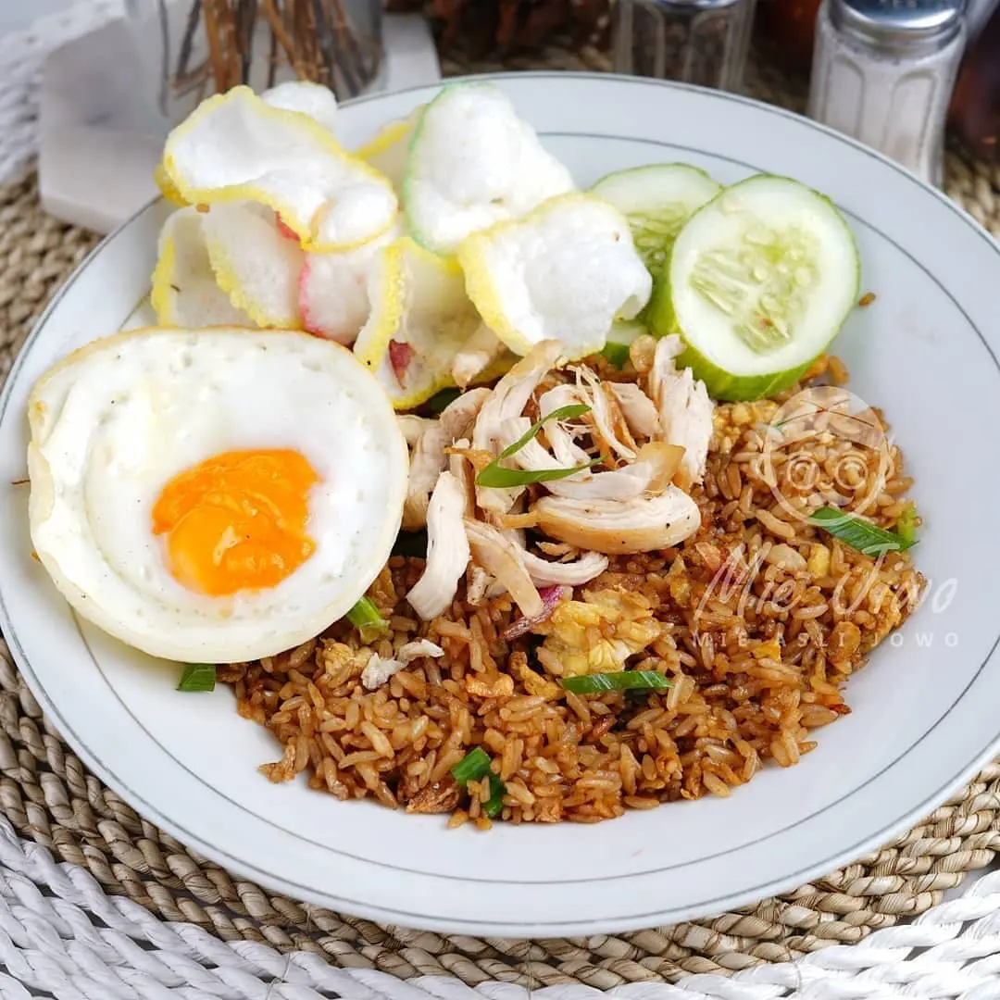
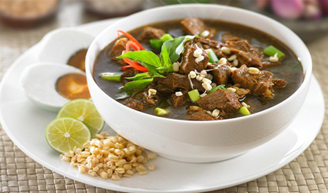
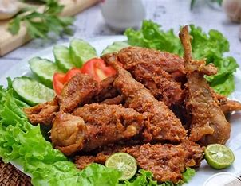
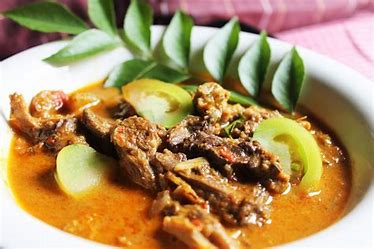

Software Requirements Specification
(Website Resep Makanan: Selera Kita)

PENDAHULUAN 
- TUJUAN
Dokumen ini merupakan Spesifikasi untuk membangun website yang efisien. Tujuan penulisan dokumen ini dengan judul “Website Resep Makanan : Selera Kita” adalah untuk mengidentifikasi dan memberikan informasi dasar yang harus dipenuhi oleh perangkat lunak yang akan dikembangkan. Dokumen ini juga memastikan bahwa pengembang website paham dan jelas tentang apa yang diharapkan dari perangkat lunak  yang dikembangkan. SKPL menjadi panduan yang berguna untuk pengembang dalam mengembangakan website dengan efesien.

- AUDIENS YANG DITUJU DAN PEMBACA YANG DISARANKAN 
Audiens : Audiens yang dituju yaitu para pecinta masakan kuliner, pecinta makanan sehat, dan ibu rumah tangga yang tertark untuk mendapatkan berbagai informasi dan resep masakkan yang mudah dan dapat dibuat sendiri.
saran : Dokumentasi SRS Website Resep Makanan ini digunakan unuk memberikan informasi kepada audiens tentang resep - resep makanan. Oleh karena itu, kami menyarankan para audiens membaca dokumen SRS ini dengan cermat.

- RUANG LINGKUP 
Perangkat lunak yang akan dikembangakan adalah Website Resep makanan yaitu Selera Kita yang dapat digunakan atau diakses oleh semua orang.

DESKRIPSI KEBUTUHAN FUNGSIONAL 
- PERSPEKTIF PRODUK
Website resep makanan "Selera Kita" yaitu sebuah website yang menampilkan berbagai resep makanan. Website ini dirancang dengan tujuan untuk menginspirasi dan membantu pengguna dalam mempersiapkan hidangan yang lezat dan memuaskan. Website ini memiliki tata letak dan desain yang muda untuk dinavigasi oleh user
Setiap resep dalam website ini disertai dengan deskripsi yang rinci, termasuk bahan - bahan yang diperlukan dan langkah - langkah memasak yang mudah untuk dipahami. Setiap resep dilengkapi dengan gambar - gambar berkualitas dari hidangan yang sudah jadi. Gambar - gambar ini memungkinkan user untuk memvisualisasikan hasil akhir dan memberikan motivasi untuk mencoba.

- FUNGSI PRODUK
Website Resep Makanan "Selera Kita" memiliki beragam fungsi. berikut merupakan beberapa fungsi dari website Resep Makanan Selera Kita :
  - Website Resep Makanan " Selera Kita" dapat memberikan informasi yang inspirasi untuk memasak dan juga 
    dapat mencoba hidangan baru.
  - Website Resep Makanan " Selera Kita" ini memberikan panduan memasak langkah demi langkah dalam 
    menghidangkan masakkan yang dipilih yang dapat membantu pengguna yang kurang berpengalaman dalam 
    memasak
  - Website Resep Makanan " Selera Kita" juga dapat menjadi sarana pembelajaran dan juga mengembangakan 
    keterampilan memasak.

- KARAKTERISTIK PENGGUNA
Karakteristik pengguna yang menggunakan perangkat lunak Task Submission yaitu:
  - Pengguna
    
    a. Memiliki perangkat elektronik (Handphone/CP)
    
    b. Memiliki akses internet
    
    c. Memahami cara kerja perangkat elektronik yang digunakan

- LINGKUNGAN OPERASI
Software Website resep makanan dapat dijalankan pada:
  - Windows
    - Windows 7,8,8.1,10
    - Web browser (Google Chrome, Firefox, Microsoft Edge)
      
  - Android
    - Android 4.0 atau lebih baik
    - RAM : 512 MB
   
  - Ios
     - iOS 9, 10, 11, 12, 13, 14, 15, atau yang lebih baru
      
- KENDALA DESAIN DAN IMPLEMENTASI
Kendala yang dialami dalam proses pembuatan desain dan implementasi website Resep Makanan “Selera Kita” yaitu:
  - Mengalami kesulitan dalam menemukan ide dan desain website yang pas.
  - Kurangnya pengetahuan teknis dalam mengembangakan website, sehingga kesulitan dalam merancang dan juga mengimplementasikan fitur yang ada.

- DOKUMENTASI PENGGUNA
Dokumen untuk membantu pengguna menggunakan website resep makanan “Selera Kita” ini terbuka untuk umum dan dapat diakses melalui web Browser, Google Chrome, Firefox, Microsoft Edge dsb.

- ASUMSI DAN KETERGANTUNGAN
Kebutuhan dari website resep makanan “Selera Kita” adalah:
  - Adanya perangkat keras yang mampu mengoperasikan Website resep makanan "Selera Kita"
  - Adanya perangkat lunak yang mampu mengoperasikan Website resep makanan “Selera Kita”
  - Koneksi internet untuk dapat terhubung ke server.

LAMPIRAN: Analisis Model
- Flowchart

   

- Use Case

  

- Activity Diagram

  

- PENJELASAN CODINGAN INDEX HTML
<!DOCTYPE html>
<html lang="en">
<head>
    <meta charset="UTF-8">
    <meta name="viewport" content="width=device-width, initial-scale=1.0">
    <title>SeleraKita.</title>
    <link rel="stylesheet" href="style.css">
</head>

    - <!DOCTYPE html> digunakan untuk mendeklarasikan atau memberi tau browser bahwa halaman ini merupakan halaman dokumen html5
    - <html lang = “en”  menunjukkan bahwa bahasa yang digunakan pada halaman merupakan bahasa inggris 
    - <head> digunakan untuk menandakan bahwa awal dari kepala dokumen HTML.
    - <meta charset = “UTF - 8” > digunakan untuk memberi tahu browser bahwa dokumen yang digunakan menggunakan set karakter UTF - 8 yang merupakan standar umum untuk encoding karakter.
    - <meta name = “viewport” content=”width=device-width initial-scale = 1.0” digunakan untuk mengontrol tampilan halaman di perangkat dengan mengatur tampilan lebar dan mengatur skala         awal 
    - <title>SeleraKita.</title> digunakan untuk menetapkan judul dokumen yang nantinya akan muncul di web browser 
    - <link rel=”stylesheet” href=”style.css”> digunakan untuk menautkan file stylesheet yang disebut “style.css” sehingga mudah untuk memodifikasi tata letak halaman dengan mengedit           file CSS terpisah
    
<body>  
<nav>
        

            
<a href=''>SeleraKita.</a>

            

                <ul>
                    <li><a href="#home">Home</a></li>
                    <li><a href="#resep">Resep</a></li>
                    <li><a href="#about">About</a></li>
                </ul>
            

        

    </nav>
    - <body> menandakan awal dari elemen tubuh dari elemen halaman HTML 
    - <nav> menunjukkan bahwa bagian ini merupakan bagian navigasi dari halaman web
    - 
 div merupakan elemen divisi yang mempunyai class “navbar” yang digunakan  untuk mengelompokkan elemen navigasi dan class “navbar” nantinya akan digunakan di        css
    - 
<a href =’ ‘>SeleraKita.</a>
 element divisi (div) yang memiliki class “Title” yang berisi tautan dengan teks “SeleraKita. “  dan teks ini merupakan judul       atau nama situs web.
    - 
 merupakan unordered list jenis daftar yang berbentuk poin poin , tidak memiliki urutan khusus biasanya digunakan untuk menampilkan daftar item yang sejajar
    - <li><a href =”#home”>Home</a></li> merupakan daftar item yang berurutan yang berisi Home yang mengarah ke elemen dengan id “home” pada halaman tersebut 
    - <li><a href =”#resep”>Resep</a></li> merupakan daftar item yang berurutan yang berisi Resep yang mengarah ke elemen dengan id “resep” pada halaman tersebut 
    - <li><a href =”#about”>About</a></li>  merupakan daftar item yang berurutan yang berisi About yang mengarah ke elemen dengan id “about” pada halaman tersebut 

<!-- untuk home -->
        <section id="home">
            
            

                
Selamat Datang di,

                <h2>SeleraKita</h2>
                
Kami adalah tim pencinta masakan yang berbagi hasrat yang sama: menciptakan dan
                    menikmati makanan yang lezat. Kami memiliki pengalaman yang luas dalam memasak dan menjelajahi
                    berbagai jenis masakan dari seluruh dunia. Setiap resep yang kami bagikan telah diuji dan diuji
                    ulang untuk memastikan kelezatan dan keberhasilannya.

            

        </section>
      - 
 div yang mempunyai class “navbar” merupakan bagian dari menu navigasi atau header situs web
      - <section id = “home”>  menandakan awal dari bagian “home” di halaman web yang berisi konten khusus terkait beranda situs web 
      -   merupakan tag gambar (img) yang menampilkan logo situs web logo ini berupa gambar file “logo.png” yang terletak di folder “fotoResep”
      - 
 div dengan class “kolom” yang digunakan untuk mengelompokkan elemen 
      - 
 Selamat Datang di, 
 merupakan paragraf yang menampilkan teks “Selamat Datang di, “ dengan class  “deskripsi”
      - <h2>SeleraKita</h2> elemen judul level 2 yang menampilkan teks “SeleraKita”
      - 
.....konten deskripsi…..
 p yang mengartikan paragraf yang berisi deskripsi lebih lanjut mengenai situs web yang menggambarkan tujuan dari situs web             “SeleraKita”. konten ini ditampilkan dengan class “deskripsi”  

<!-- untuk resep -->
<section id="resep">
            <ul class="catCardList">
                <li class="catCardList">
                    

                    

                    <h3>Nasi Goreng</h3>
                    
Nasi goreng adalah makanan berupa nasi yang digoreng dan dicampur dalam minyak goreng, margarin,
                        atau mentega. Biasanya ditambah dengan kecap manis, bawang merah, bawang putih, asam jawa, lada
                        dan bahan lainnya; seperti telur, daging ayam, dan kerupuk.

                    
<a href="resepnasgor.html">Lihat Resep</a>

                    

                    

                </li>
                <li class="catCardList">
                    

                    

                    <h3>Soto Ayam</h3>
                    
Soto ayam adalah makanan khas Indonesia yang berupa sejenis sup ayam dengan kuah yang berwarna kekuningan.
                        Warna kuning ini dikarenakan oleh kunyit yang digunakan sebagai bumbu. Soto ayam banyak ditemukan di daerah-
                        daerah di Indonesia dan Singapura.

                    
<a href="resep soto.html">Lihat Resep</a>

                    

                    

                </li>
                <li class="catCardList">
                    

                    

                    <h3>Rawon</h3>
                    
Rawon adalah sebuah hidangan tradisional Indonesia yang terkenal, terutama di daerah Jawa Timur.
                        Hidangan ini merupakan semacam sup berwarna hitam pekat yang memiliki rasa yang khas dan kaya
                        rempah. Bahan utama dari rawon adalah daging sapi, terutama bagian daging sapi yang empuk seperti
                        tengkleng atau iga.

                    
<a href="resep rawon.html">Lihat Resep</a>

                    

                    

                </li>
                <li class="catCardList">
                    

                    

                    <h3>Rendang</h3>
                    
Rendang adalah hidangan khas Indonesia yang berasal dari Minangkabau, Sumatra Barat. Hidangan ini terkenal
                        karena daging sapi yang dimasak dalam santan kelapa dan rempah-rempah hingga meresap, menciptakan cita rasa
                        yang kaya, pedas, gurih, dan beraroma rempah. Rendang bukan hanya menjadi bagian penting dalam kuliner Indonesia
                        tetapi juga telah mendapatkan pengakuan internasional sebagai salah satumakanan terenak di dunia.

                    
<a href="resep rendang.html">Lihat Resep</a>

                    

                    

                </li>
                <li class="catCardList">
                    

                    

                    <h3>Ayam Bumbu Rujak</h3>
                    
Ayam bumbu rujak adalah hidangan lezat yang berasal dari Indonesia. Ayam potong dipadu dengan bumbu rujak
                        yang khas, menciptakan kombinasi cita rasa yang unik. Ayam dimasak dalam bumbu ini hingga meresap,
                        emberikan rasa yang kaya dan memuaskan. Tidak hanya memikat lidah orang Indonesia tetapi juga populer
                        di kalangan pecinta kuliner di berbagai belahan dunia.

                    
<a href="resepayambumburujak.html">Lihat Resep</a>

                    

                    

                </li>
                <li class="catCardList">
                    

                    

                    <h3>Mie Aceh</h3>
                    
 Mie Aceh adalah hidangan mie pedas khas Aceh, Indonesia, yang terkenal dengan kekayaan rempah-rempahnya.
                        Keunikan Mie Aceh terletak pada penggunaan bumbu khusus yang disebut "gulai" yang memberikan rasa pedas
                        dan gurih yang khas. Dalam hidangan ini, mie yang direbus dengan sempurna disajikan dengan potongan
                        daging sapi atau kerang, irisan bawang merah, dan ditaburi daun bawang cincang. Mie Aceh menjadi salah satu
                        kuliner favorit di Indonesia. 

                    
<a href="resepMieAceh.html">Lihat Resep</a>

                    

                    

                </li>
                <li class="catCardList">
                    

                    

                    <h3>Gulai Kambing</h3>
                    
 Gulai kambing adalah hidangan khas Indonesia yang terkenal dengan cita rasa lezat dan kaya rempah.
                        Daging kambing yang dipotong-potong dimasak dalam kuah santan yang kental dan diperkaya dengan berbagai
                        rempah yang memberikan gulai kambing karakteristiknya yang kaya dan aromatik yang menjadikan gulai kambing
                        menajdi favorit di berbagai daerah di Indonesia. 

                    
<a href="resep gulai.html">Lihat Resep</a>

                    

                    

                </li>
                <li class="catCardList">
                    

                    

                    <h3>Rica-rica</h3>
                    
Rica-rica adalah hidangan khas Indonesia yang berasal dari daerah Manado, Sulawesi Utara. Rica-rica dikenal
                        dengan kepedasan dan kelezatan rempahnya. Rica-rica umumnya terdiri dari daging ayam, ikan, atau daging lainnya
                        yang dimasak dengan bumbu pedas dan rempah-rempah.  Keunikan rasa rica-rica terletak pada kepedasannya yang menyengat
                        dan paduan bumbu rempah yang memberikan sentuhan gurih dan harum. Rica-rica biasanya disajikan bersama nasi putih
                        dan sayuran sebagai pelengkap. 

                    
<a href="reseprica.html">Lihat Resep</a>

                    

                    

                </li>
            </ul>
    - <section id = “resep” menandakan awal dari bagian “resep” di halaman web yang berisi daftar atau kartu resep yang akan ditampilkan kepada pengguna 
    - <ul class = “catCardList”> ul (unordered list) merupakan daftar yang tak berurut yang memiliki class “catCardlist”
    - <li class =”catCardlist”>  li(list item) yang memiliki class “catCardList”.
    - 
 div yang memiliki class “catCard yang digunakan untuk menampilkan resep tertentu 
    - <a href =”#” > mengarah ke tautan yang kosong 
    -  merupakan tag gambar (img) yang menampilkan gambar resep nasi goreng.
    - 
 div yang memiliki class “loweCatCard” yang digunakan untuk menampilkan detail resep lebih lanjut 
    - <h3>Nasi Goreng </h3> elemen judul level 3 yang menampilkan judul resep “Nasi Goreng”
    - 
 ….kontendeskripsi..
 paragraf yang menjelaskan mengenai nasi goreng 
    - 
<a href="resepnasgor.html">Lihat Resep</a>
 div dengan id “catCardButton” dan kelas “button” yang berisi tautan “Lihat Resep”. tautan          ini akan mengarah ke halaman yang berisi resep nasi goreng secara lebih rinci 

      <a href="indexresep.html">Selengkapnya...</a>

    - 
 merupakan elemen div yang memiliki class “selengkapnya”. elemen div digunakan untuk membuat kotak terpisah dalam dokumen HTML dan digunakan untuk             mengatur gaya elemen menggunakan css
    - <a href = “indexresep.html”>Selengkapnya…</a> merupakan tautan yang memiliki atribut href yang menunjukkan tujuan tautan pada halaman “indexresep.html”. “Selengkapnya…” akan              ditampilkan di halaman web sebagai tautan yang dapat di klik oleh pengguna dan beralih ke halaman yang ditentukan dalam herf

      <section id="about">

        

            

               
                

                    <h3>About</h3>
                    
Kami adalah tim pencinta masakan yang berbagi hasrat yang sama: menciptakan dan menikmati makanan yang lezat.
                        Setiap resep yang kami bagikan telah diuji dan diuji ulang untuk memastikan kelezatan dan keberhasilannya.
                    

                

                

                    <h3>Contact</h3>
                    
Jl. Punya Kita No.07 Surabaya

                    
Kode Pos: 57365

                

                

                    <h3>Social</h3>
                    
<b>YouTube   : </b>Selera Kita

                    
<b>Instagram : </b>selerakita.id

                    
<b>Facebook  : </b>Selera Kita

                

            

        

    

    </section>
    - <section id =”about”> digunakan untuk menandai awal bagian “about” di halaman web yang berisi mengenai informasi dan juga kontak dan akan digunakan di css
    - 
 div yang memiliki id “Contact”. dan id “contact” akan di gunakan di css 
    - 
 div dengan class “wrapper” yang digunakan untuk mengelompokan elemen dan juga untuk mengatur tata letak atau gaya 
    - 
 div dengan class “footer” yang digunakan untuk mengelompokan bagian bawah situs web seperti kontak media sosial dan about  
    - 
  div dengan class “footer - section digunakan untuk mengelompokan informasi tertentu dari bagian footer situs web 
    - <h3> About </h3> digunakan untuk elemen judul level 3 yang menampilkan “About”
    - 
 ….konten deskripsi …
 merupakan paragraf yang digunakan untuk menjelaskan informasi mengenai web Selera kita
    - <h3>Contact</h3> digunakan untuk elemen judul level 3 yang menampilkan “Contact”
    - 
...konten deskripsi….
 merupakan paragraf yang digunakan untuk menampilkan informasi kontak 
    - <h3> Sosial</h3> digunakan untuk elemen judul level 3 yang menampilkan “Sosial” 
    - 
 …..konten media sosial…
 digunakan untuk paragraf yang nantinya akan menampilkan akun sosial media seperti YouTube, Instagram, dan Facebook 

	

       

